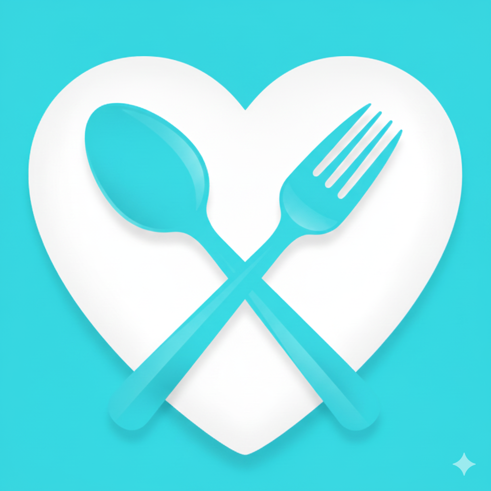

<div align="center">
  
  
  #  DearU Food
  
  ### Modern Food Delivery Experience
  
  *Built with React Native, Expo & Supabase*
  
  [](https://www.typescriptlang.org/)
  [](https://reactnative.dev/)
  [](https://expo.dev/)
  [](https://supabase.com/)
  
  [](LICENSE)
  [](docs/CONTRIBUTING.md)
  
  [ Documentation](docs/)  [ Quick Start](#-quick-start)  [ Contributing](docs/CONTRIBUTING.md)
  
</div>

---

##  Features

-  **Smart Home Screen** - GPS location, restaurant discovery, category filtering
-  **Food Ordering** - Browse menus, manage cart, track orders, reorder favorites
-  **User Management** - OAuth (Google/Github), profile settings, saved addresses
-  **Location Services** - Auto-detect GPS, address search, interactive map picker
-  **Real-time Updates** - Order status, push notifications, live tracking
-  **Modern UI** - NativeWind/Tailwind CSS, smooth animations, responsive design
-  **Cross-Platform** - iOS, Android, Web support with single codebase
-  **Secure & Private** - Supabase Auth, Row Level Security, encrypted storage

---

##  Quick Start

### Prerequisites

- Node.js 18+ & npm/yarn
- Expo CLI: `npm install -g expo-cli`
- [Supabase account](https://supabase.com) (free tier)

### Installation

```bash
# Clone & install
git clone https://github.com/iamnguyenvu/food-delivery-app.git
cd food-delivery-app
npm install

# Setup environment
cp .env.example .env
# Add your Supabase credentials to .env:
# EXPO_PUBLIC_SUPABASE_URL=your_url
# EXPO_PUBLIC_SUPABASE_ANON_KEY=your_key

# Start development
npm start

# Run on platform
npm run android    # Android
npm run ios        # iOS (macOS only)
npm run web        # Web browser
```

>  **Need help?** Check [Setup Guide](docs/SETUP.md) for detailed instructions.

---

##  Tech Stack

### Frontend
<p>
  
  
  
  
</p>

### Backend & Services
<p>
  
  
  
</p>

### State & Tools
<p>
  
  
  
  
</p>

>  **Learn more:** [Architecture Documentation](docs/ARCHITECTURE.md)

---

##  Project Structure

```
food-delivery/
 app/                     # Expo Router (file-based routing)
    (tabs)/             # Tab navigation
       index.tsx       #  Home
       orders.tsx      #  Orders
       favorites.tsx   #  Favorites
       profile.tsx     #  Profile
    (screens)/          # Stack screens
       auth/           # Authentication
       location-*.tsx  # Location features
    _layout.tsx         # Root layout

 components/             # React components
    common/            # Shared UI
    index/             # Home components
    location/          # Location features
    profile/           # Profile components

 src/
    contexts/          # React contexts
    hooks/             # Custom hooks
    lib/               # Utils & services
       supabase.ts    # Supabase client
       geocoding.ts   # Geocoding
    store/             # Zustand stores
       authStore.ts
       cartStore.ts
       locationStore.ts
    types/             # TypeScript types

 assets/                # Images, fonts
 docs/                  # Documentation
    SETUP.md
    ARCHITECTURE.md
    API.md
    CONTRIBUTING.md

 Configuration
     .env.example
     app.json
     tsconfig.json
     tailwind.config.js
```

---

##  Development

### Commands

| Command | Description |
|---------|-------------|
| `npm start` | Start Expo dev server |
| `npm run android` | Run on Android |
| `npm run ios` | Run on iOS (macOS) |
| `npm run web` | Run in browser |
| `npm run type-check` | Check TypeScript |
| `npm run lint` | Run ESLint |
| `npm run format` | Format with Prettier |
| `npm start -- --clear` | Clear cache & start |

### Workflow

1. **Branch:** `git checkout -b feature/your-feature`
2. **Develop:** Make changes & test
3. **Check:** `npm run type-check && npm run lint`
4. **Commit:** `git commit -m "feat: your feature"`
5. **Push:** `git push origin feature/your-feature`
6. **PR:** Open pull request

>  Use [Conventional Commits](https://www.conventionalcommits.org/) format.

---

##  Documentation

| Document | Description |
|----------|-------------|
| [ Setup Guide](docs/SETUP.md) | Installation & configuration |
| [ Architecture](docs/ARCHITECTURE.md) | Technical design |
| [ API Reference](docs/API.md) | Backend endpoints |
| [ Contributing](docs/CONTRIBUTING.md) | Contribution guide |
| [ Changelog](docs/CHANGELOG.md) | Version history |

---

##  Contributing

We welcome contributions! 

**How to contribute:**

1.  Fork the repo
2.  Create branch: `git checkout -b feature/amazing`
3.  Make changes & commit: `git commit -m 'feat: amazing feature'`
4.  Push: `git push origin feature/amazing`
5.  Open Pull Request

**Ways to help:**
-  Report bugs
-  Suggest features
-  Improve docs
-  Submit PRs

>  Read our [Contributing Guide](docs/CONTRIBUTING.md) for details.

---

##  Team

**Nguyen Hoang Nguyen Vu** ([@iamnguyenvu](https://github.com/iamnguyenvu))

<p>
  <a href="https://github.com/iamnguyenvu">
    
  </a>
  <a href="mailto:iamnguyenvu.gm@gmail.com">
    
  </a>
</p>

---

##  License

Licensed under the **MIT License**. See [LICENSE](LICENSE) for details.

**Copyright  2025 DearU Food & Nguyen Vu**

---

##  Acknowledgments

Built with amazing open-source tools:

<p align="center">
  <a href="https://expo.dev"></a>
  <a href="https://supabase.com"></a>
  <a href="https://nativewind.dev"></a>
  <a href="https://tanstack.com/query"></a>
  <a href="https://github.com/react-native-maps/react-native-maps"></a>
</p>

---

<div align="center">

###  Star Us!

If you find this project helpful, please give it a star!

[](https://github.com/iamnguyenvu/food-delivery-app/stargazers)

---

<div align="center">

  **Made with ❤️ and ☕**

  **© 2025 [DearU Food](https://github.com/iamnguyenvu/food-delivery-app). All rights reserved**

</div>

[ Back to Top](#-dearu-food)

</div>
